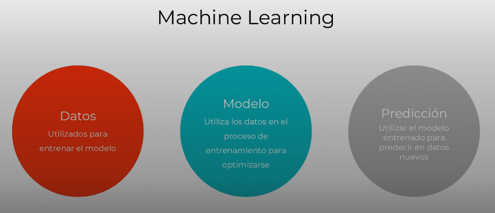

# Las bases del machine learning

## Introduccion

En el presente curso veremos que es el machine learing y comó es que se diferencia de la programacion regular.

Tambien conoceras diferentes tipos de algoritmos de machine learing para aplicar lo aprendido.

Despues hablaremos lo que es deep learing y redes neuronales, para aplicar en diferentes problemas, entre ellos la clasificacion de imagenes.

Finalmente aprenderemos acerca de la tranferencia de aprendizaje para utilizar modelos existentes y aplicarlos en problemas.

El proyecto sera crear un clasificador de imagenes.

## Como funciona un modelo de Machine Learning

A estos modelos le damos muchos datos de entrenamiento, para que aprenda de estos, utilizando modelos matematicos y estadisticos, para despues utilizar este modelos ya entrenado y hacer predicciones y datos que nunca vieron.

## Diferencia con la programacion convencional

Cuando creamos software con programacion regular, nosotros tenemos que poner explicitamente que debe pasar segun que caso; es decir nosotros sabemos las entradas y salidas en la logica de programacion.

## Necesidades del Machine Learning

En el machine learing nosotros nos encargamos de encontrar los suficientes datos para el entramiento de una modelo para un caso especifico.

* El modelo aprende por si solo.
* Nosotros no enfocamos en encontrar la cantidad suficiente de datos.
* Elejir el modelo y algoritmo adecuado.
