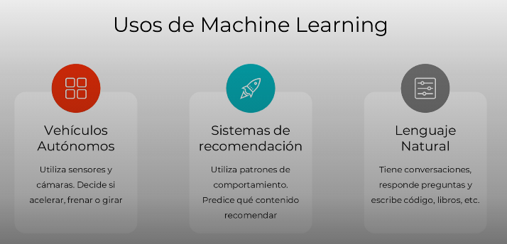

# Aplicacion del Machine Learing

1. En un inicio el machine learning se usaba para tareas muy especificas, como encontrar patrones o para electrocardiogramas.
2. En la actualidad se usa mas machine learning para cosas increibles, como en los vehiculos autonomos, utilzan sensores y camaras que proporcionan los datos, y el modelo decide si girar acelerar, frenar, etc.
3. Los sistemas de recomendacion usan actualmente el machine learing para predecir los gustos del usuario.
4. Tambien podemos usar modelos de machine learing para el dia a dia de un negocio, un ejemplo es segmentar el comportamiento de los clientes basados en su preferencias al comprar.

