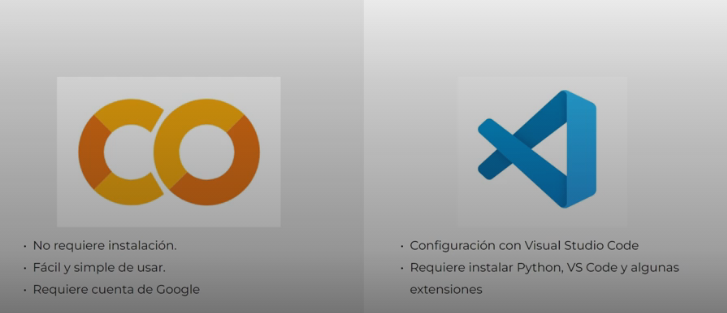
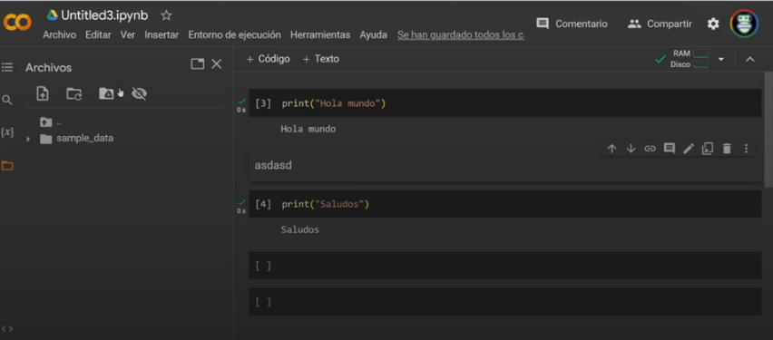
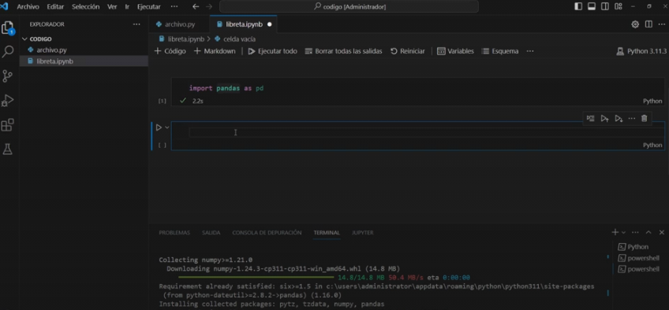

# Configuracion del Ambiente de Trabajo

## 1. Google Colab

Podemos programar ern python usando usando la web de google colab.

Este entorno crea un entorno, que solo funcionara mientres se ejecute, si nos vamos a otra computadora, tendremos que volver a ejecutar.

Ademas Google colab tambien acepta subir archivos, pero si actualiza la web tiene q volver a subirce los archivos

Otra ventaje de trabajar en google colab, es que podemos cambiar la forma de trabajo de CPU a GPU

## 2. VS CODE - Jupyter

Para poder trabajar desde una PC, nesecitaremos 3 programas: python, vscode, jupyter.

Una de las desventajas de usar VS code es que solo podemos ejecutar el codigo usando la CPU, la ejecucion se vera lenta a compracion de google colab.

