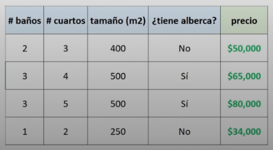
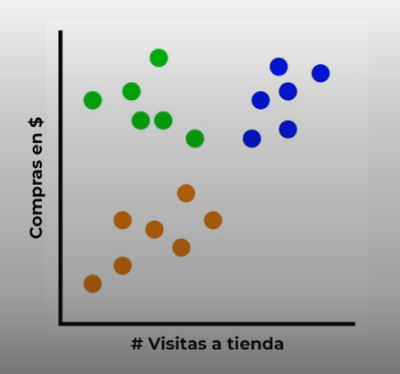

# Tipos y ejemplos de machine learning

1. ## Aprendizaje Supervisado

   Contamos con un conjunto de datos o set de datos, con caracteristicas y una etiqueta con la respuesta correcta para cada uno.

   Por ejemplo si estamos desarrollando un modelo para predecir el precio de una casas, podemos contar con un set datos que cuenta con caracteristicas, como numero de baños, numero de cuartos, tamaño en m2; ademas cada uno cuentacon su etiqueta o con sus precios.

   
   Con estos datos el modelo relaciona numericamente las caracteristicas y el precio, a partir de estos datos el modelo predice el precio de una casa que nunca vio.

   Este ejemplo es un **Modelo de regresió**, son modelo predicen a predir un numero.

   Tambien existe otros modelos como:

   - Modelo de Clasificacion .- En los cuales la respuesta esta limitada a una serie de opciones, por ejemplo un modelo que en baser a una imagen nos dice si es un gato o un perro.
2. ## Aprendizaje no Supervisado

   Contamos con un conjunto de datos sin etiquetas, apartir de estos datos encontrar patrones y relacioones entre ellos.

   Un ejemplo, tener muchos datos y usar modelo de closterisacion o agrupamiento para por si solo agrupe a distintos tipos de clientes, y asi el modelo nos muestra 3 grupos basados en gastos y en visitas a al tienda:

   - Un grupo que va poco pero compra mucho
   - Un grupo que va mucho pero compra muy poco
   - Un grupo que va muy poco y que compra muy poco.

   
3. ## Aprendizaje por Refuerzo

   Para este tipo de aprendizaje necesitaremos de una agente en un ambiente y por medio de acciones y retroalimentacion.
   Ademas establecemos reglas de lo que esta bien y mal, agregado que recompenzamos las buenas acciones del modelo y lo castigamos si lo hizo mal.

   Este tipo de aprendizaje esta en constante cambio, el ambiente esta en constante cambio de estado.
