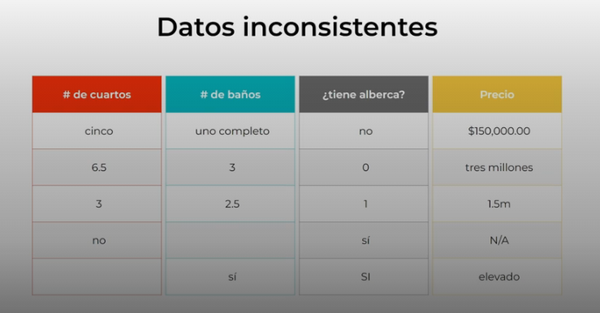

# Los datos: la base de cualquier modelo

Los datos son el corazon de cualquier proyecto de machine learing.
como vimos el aprendizaje supervisado, los modelos aprende usando un conjunto de datos, por lo tanto si tenemos malos datos tendremos una resultado.

Contar con buenos datos, no es tan simple, ya que no es mismo tener mucho datos que tener buenos datos.

La mayor parte del tiempo se invierte de tener datos de calidad, para llegar a ese punto tenemos que hacer filtros, organizar, etc; ya que estos datos pueden tener inconsistencia.

Despues de tener los datos, tenemos que identificar las caracteristicas mas relevantes para nuestro modelo.

Por ejemplo para un modelo para sacar el precio de una casa.

Hay otros datos que no son nesesario o irrelvantes para el desarrollo de nuestro modelo, y estos deben ser separados de los datos nesesarios, ya que el modelo puede encontrar patrones incoherentes.

Una vez se halla seleccionado los datos, se debe seperar las caracteriticas de las etiquetas, realmente separamos nuestros datos en un conjunto de entrenamiento y de prueva.

Un 80 % se usa para que el modelo se entrene y se ajuste su estructura, el otro 20% se usa para evaluar el modelo y para ver que tan bien quedo.

**Los dato son la base de todo proyecto de machine learing**
