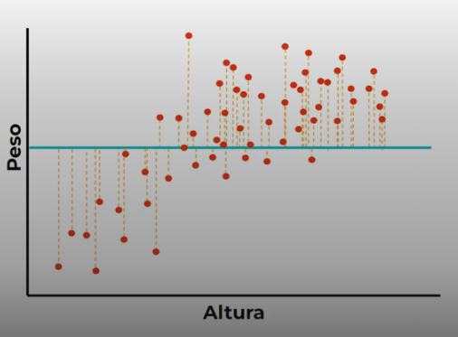

# Regresion Lineal en Detalle

La regresion lineal nos sirve para graficar la relacion entre la variable dependiente por una o mas varias variables independiente.

En un ejemplo de la relacion entre peso y altura, queremos encontrar la relacion entre el peso segun la altura.

Sin enbargo un modelo no solo tiene dos variables, puede terner de dos a mas variables relacionadas, sin enbargo tratrar de graficar un modelo de mas de tres dimenciones es muy complicado, la forma mas simple de representar esta informacion es en matrices, tablas o vectores.

Normalmente un modelo de aprendizaje tiene mas de dos variables de entradas, por ejemplo para un modelo de tre variables de entrada, deberiamos usar una grafica tridimencional.

## Proceso de Regresion Lineal

El proceso comienza con el algoritmo agregando una linea cualquiera en los datos.

Despues calcula la distancia de cada punto a la linea, estas distancias son residuos; entonces cuando mas grande sea esta residuo, peor funciona el modelo.

El objetivo del proceso es **minimizar el residuo**.

Cuando graficamos una ecuacion lineal.
Usamos la siguiente expresion:  `y = mx + b`, donde:

* `y` es la variable dependiente - **DATO DE SALIDA.**
* `x` es la variable independiente - **DATO DE ENTRADA.**
* `m` es la pendiente de la línea o inclinación de la linea.
* `b` es el punto de intersección con el eje y.

Por la tanto lo que quiere este proceso es encontrar los mejores valores para la pendiente m y el corte b; de manera que minise el resultado de la suma de los residuos.

Y en este algoiritmo especifico busca minizar la suma de los residuos elavados al cuadrado.
